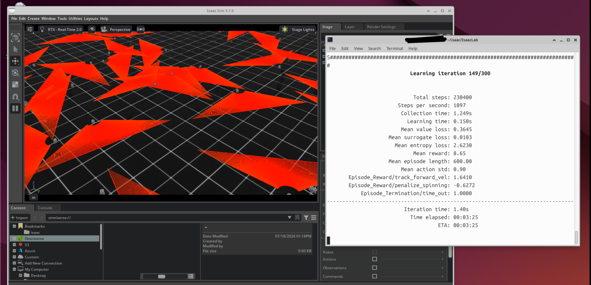

# Vectorized Reinforcement Learning for TurtleBot3 Straight-Line Locomotion in Isaac Lab

[](https://github.com/isaac-sim/IsaacLab)
[](https://github.com/leggedrobotics/rsl_rl)
[]()
[]()

An end-to-end implementation of a massively parallelized, manager-based reinforcement learning environment using **NVIDIA Isaac Lab** and **Proximal Policy Optimization (PPO)** via the **RSL-RL** library. This project trains a differential drive TurtleBot3 robot to achieve high-speed, stable, straight-line locomotion from scratch.

---

## 📊 Training Preview



*Figure: Parallel vectorized instances of TurtleBot3 learning optimal wheel velocity control within Isaac Lab.*

---

## 📌 Project Architecture & File Mapping

The task is designed as an isolated, modular extension within the Isaac Lab environment manager. It is cleanly partitioned into three configuration scripts:

```text
isaaclab_tasks/manager_based/turtlebot3/
├── __init__.py               # Environment registration and Gym hook
├── turtlebot3_asset_cfg.py   # Simulation scene details & physical actuator configurations
└── turtlebot3_env_cfg.py     # Complete MDP formulation (Observations, Actions, Rewards)
