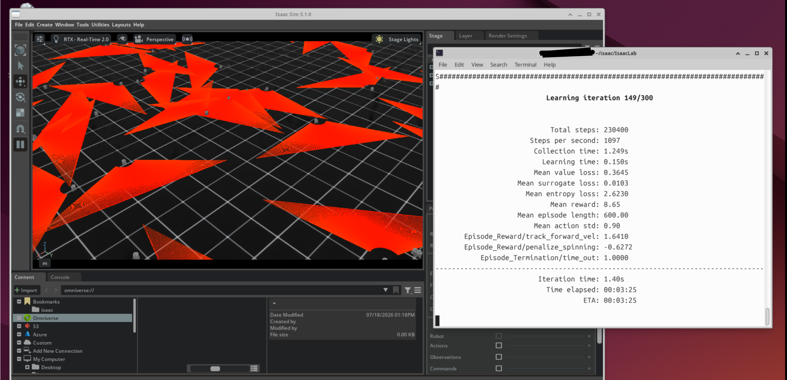
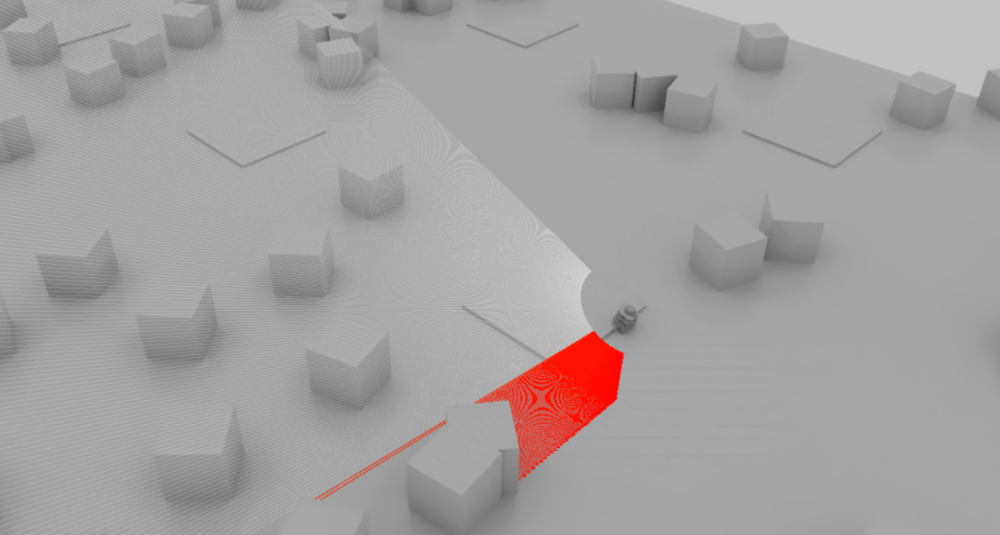

# Vectorized Reinforcement Learning for TurtleBot3 Locomotion & Obstacle Avoidance in Isaac Lab

Author: Alejandro Meza Tudela

[](https://github.com/isaac-sim/IsaacLab)
[](https://github.com/leggedrobotics/rsl_rl)
[]()
[]()

An end-to-end implementation of a massively parallelized, manager-based reinforcement learning environment using **NVIDIA Isaac Lab** and **Proximal Policy Optimization (PPO)** via the **RSL-RL** library. This project traces the incremental development of a differential drive TurtleBot3 robot—starting from basic high-speed straight-line locomotion to 2D LiDAR-based obstacle navigation in procedural environments.

---

## 📊 Training Environments & Preview

### Phase 1: Baseline Straight-Line Locomotion
The initial baseline environment trains the TurtleBot3 on a flat, obstacle-free ground plane to achieve stable forward velocity control while minimizing excessive yaw spinning.


*Figure 1: Parallel vectorized instances of TurtleBot3 learning basic forward velocity control on a flat plane.*

---

### Phase 2: LiDAR Sensing & Obstacle Avoidance
The environment scales up to procedurally generated grid terrains featuring static box obstacles per environment cell. The TurtleBot3 is augmented with a 360° single-channel 2D LiDAR raycaster to perceive spatial obstacles directly within its observation space.


*Figure 2: Parallel vectorized instances navigating procedurally generated box obstacle terrains using 2D LiDAR raycasting.*

---

## 🤖 TurtleBot3 Platform & MDP Details

The [TurtleBot3 (Burger)](https://github.com/ROBOTIS-GIT/turtlebot3) by ROBOTIS is a widely adopted, open-source, differential-drive mobile robot chassis.

### Physical & Kinetic Specifications
* **Kinematics:** Differential drive system driven by independent wheel joint actuators.
* **Actuation Type:** Velocity-controlled joints (`JointVelocityActionCfg`) mapping continuous actions to target wheel angular velocities ($[v_{\text{left}}, v_{\text{right}}]$).

### MDP Configuration
* **Action Space:** Continuous 2D vector for differential wheel velocity commands (scale factor $= 5.0$).
* **Observation Space:**
  * **Baseline:** Base linear velocity ($v$), angular velocity ($\omega$), and joint velocities ($\dot{q}$).
  * **LiDAR Variant:** Adds a 360° horizontal raycast distance vector (36 beams at $10^\circ$ resolution, max distance $2.0\text{m}$).
* **Terrain & Raycasting:** $8 \times 8$ procedurally generated sub-terrain mesh of repeated static boxes ($0.4\text{m} \times 0.4\text{m} \times 0.8\text{m}$) with a $1.0\text{m}$ clear spawn platform at the center of each cell.

---

## 📌 Project Architecture & File Mapping

The environment is built using Isaac Lab's modular `ManagerBasedRLEnv` structure:

```text
isaaclab_tasks/manager_based/turtlebot3/
├── __init__.py               # Environment registration and Gym hook
├── turtlebot3_asset_cfg.py   # Simulation scene details & physical actuator configurations
└── turtlebot3_env_cfg.py     # Complete MDP formulation (Observations, Actions, Rewards, LiDAR & Terrain)
```

---

## 💻 Hardware Setup
* GPU: NVIDIA GeForce RTX 4070 Ti Super


